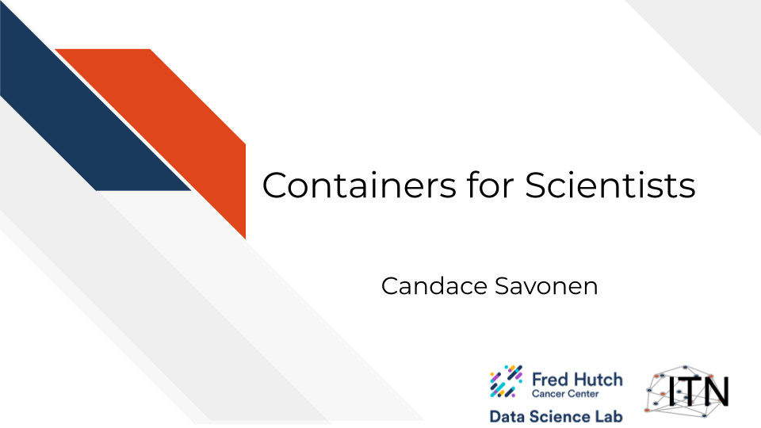
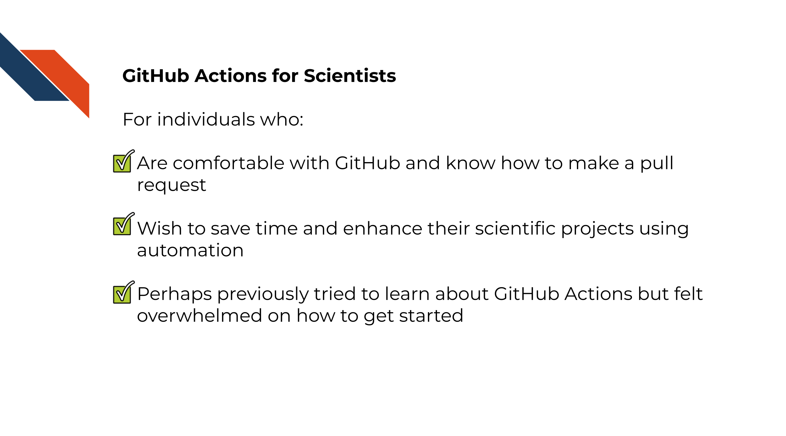
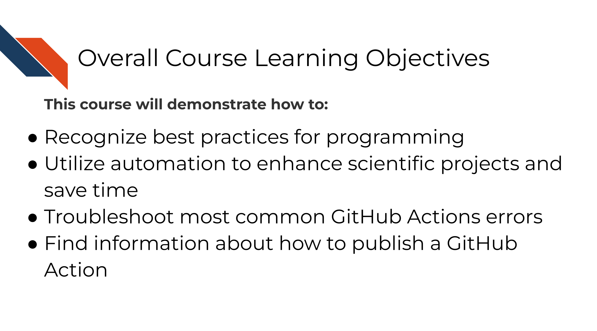

# Introduction

## Target Audience  

The course is intended for students in the biomedical sciences and researchers who use informatics tools in their research

_This course is written for individuals who:_   

- Are comfortable with bash and command line
- Write code for scientific projects
- Perhaps tried to use Docker or another containerization software before but felt overwhelmed or confused on how to get started
- Want to learn best practices for using containers

## Topics covered

This course covers how to use containers for scientific software development. We encourage the recognition that scientific software can take many forms that can all benefit from the concepts of continuous integration and continuous deployment.

This course builds on concepts introduced in the [Reproducibility](https://jhudatascience.org/Reproducibility_in_Cancer_Informatics/introduction.html) and [Advanced Reproducibility](https://jhudatascience.org/Adv_Reproducibility_in_Cancer_Informatics/introduction.html) courses from the ITCR Training Network. If you are unfamiliar with GitHub and/or do not have an account, we'd suggest you start with those courses by using the links above.

## Motivation

Cancer datasets are plentiful, complicated, and hold untold amounts of information regarding cancer biology. Cancer researchers are working to apply their expertise to the analysis of these vast amounts of data but training opportunities to properly equip them in these efforts can be sparse. This includes training in reproducible data analysis methods.

Data analyses are generally not reproducible without direct contact with the original researchers and a substantial amount of time and effort [@BeaulieuJones2017]. Reproducibility in cancer informatics (as with other fields) is still not monitored or incentivized despite that it is fundamental to the scientific method. Despite the lack of incentive, many researchers strive for reproducibility in their own work but often lack the skills or training to do so effectively.

Equipping researchers with the skills to create reproducible data analyses increases the efficiency of everyone involved. One tool among many for creating reproducible analyses is utilizing automation. Many individuals performing analyses on cancer data may not have formal training in software development and may be unfamiliar with the ideas of continuous integration and continuous deployment. By recognizing that biological data analysis code is a form of software development, we can try to adapt good development practices in scientific analyses and software contexts.

_Scientific software projects may include (but aren't limited to):_

- Software that built as tools to be utilized by others to analyze biologically derived data.
- Code that is built primarily for analyzing one project's data.
- Code that is built as a workflow for a series of steps and analyses that might be reused among collaborators or within a lab.
- Any scripts and code that are built to handle data in a research setting.
- Any scripts and code a researcher might interact with.

## Curriculum  

The course includes hands-on exercises for how to use, modify, share, and troubleshoot containers for scientific software development purposes.

**Goal of this course:**  
Equip learners with basics skills and confidence to utilize the containers within the context of scientific software analyses.

**What is not the goal**  
This course is meant to teach learners how to create sophisticated GitHub Actions, but instead introduce learners to basic fundamentals of continuous integration and continuous deployment. This course focuses on GitHub Actions and will not cover any other (perfectly fine) tools for CI/CD.

## How to use the course

Ideally you should follow along with the chapters and perform the activities as they are described. These activities involve using Docker or optionally Podman.

We also recommend that if you'd like to fully leverage your container skills after taking this course you may also enjoy our [GitHub Actions course](https://hutchdatascience.org/GitHub_Automation_for_Scientists/) that pairs well with the skillset taught here. 
