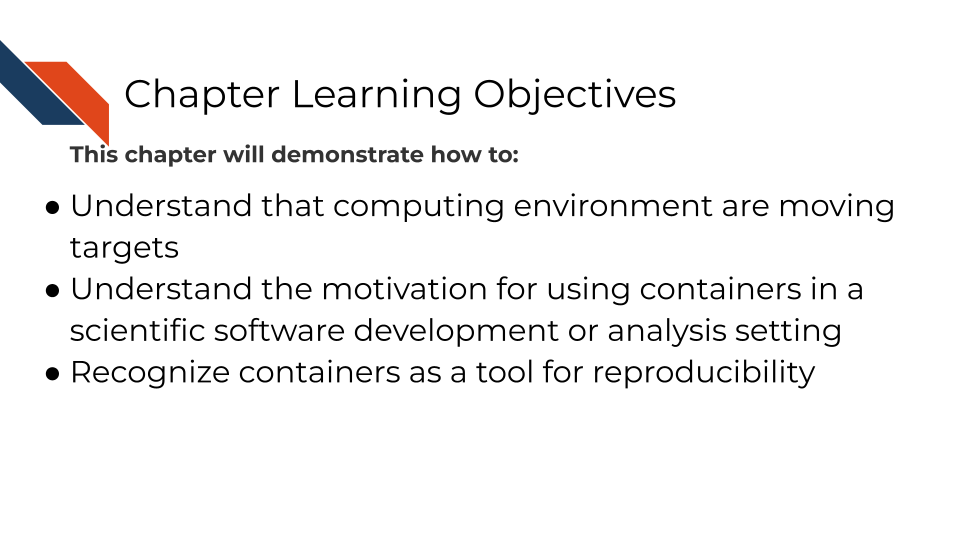
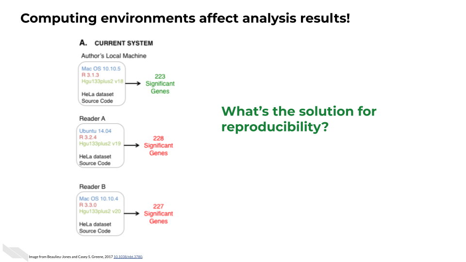
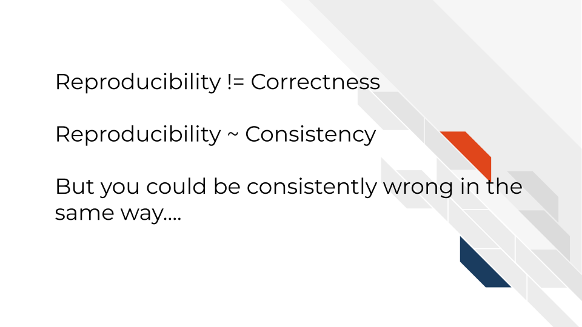
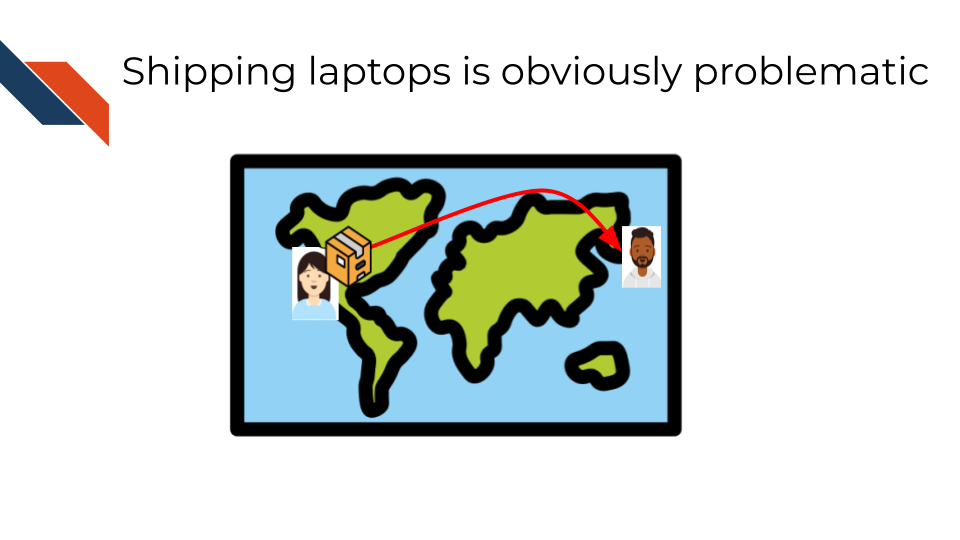
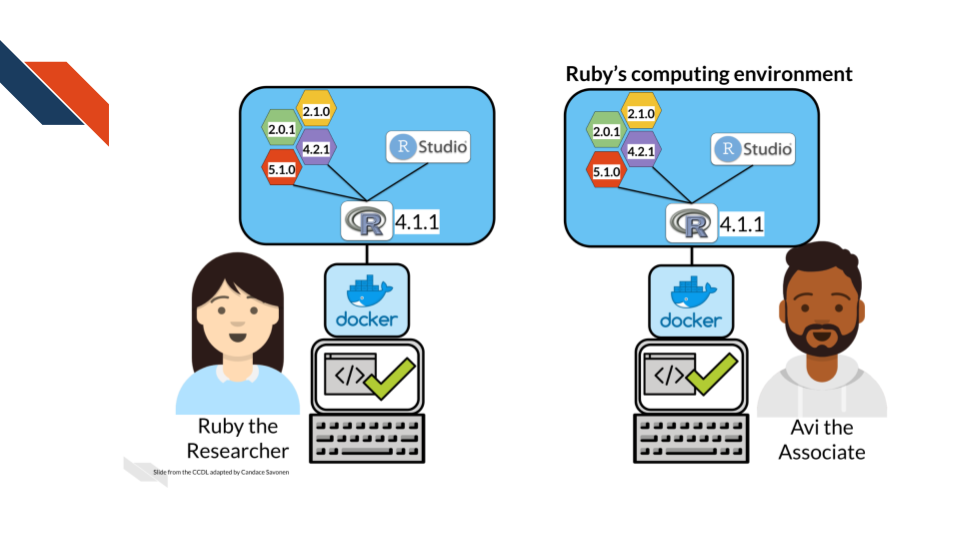
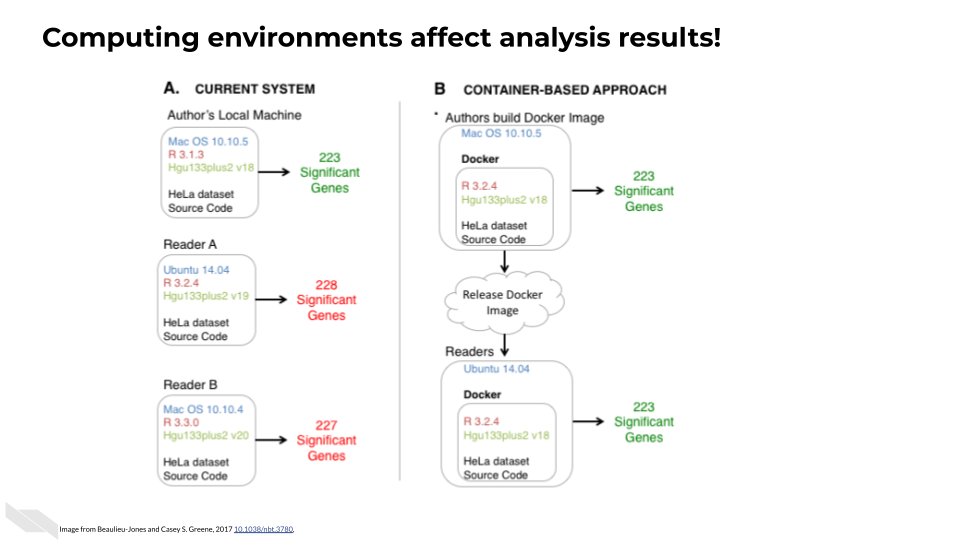
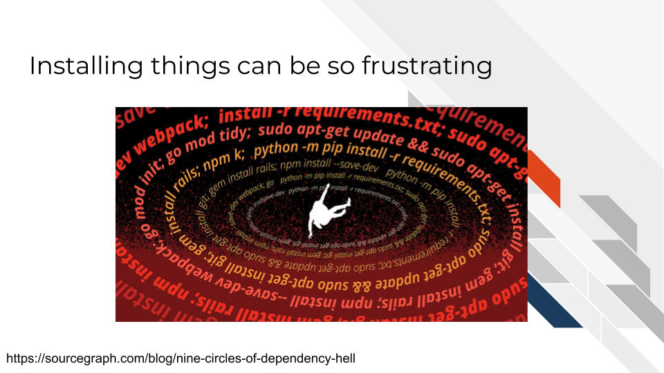
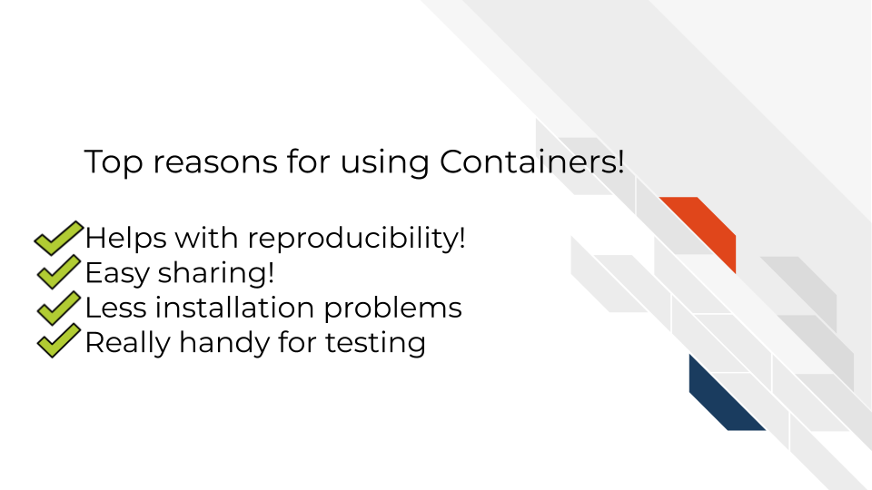
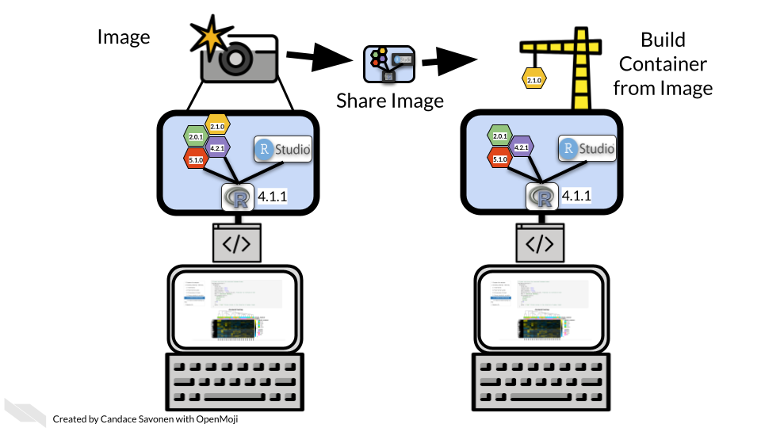

# Why Containers?

## The problem

In todays data driven world, science is driven by computer work. But each of these computers is unique. This goes far beyond "Mac vs PC". Every computer has a special configuration of software and software versions that is installed on it. Some of this is determined by the user of the computer, some was designed by company that sells the computers, and some is even controlled by institutions and their IT departments that manage the computers.

Software programs can give us a very example of what differing computing environments can look like by printing out this information. This side-by-side example below shows two different computers' computing environments. This printout comes from using `sessionInfo()` in the R programming language. You can see it not only do these two computing environments differ by operating system, but also by software packages installed, software packages loaded, and the versions of these software packages.

Not only are our computers at one point in time very unique, but as time moves forward computers and the software environments change very rapidly. Some of this happens through intentional installations of programs by computer users and some are automatic software updates that they may not be aware of that are instigated by the developers of the hardware and software that make up the computer.

Computing environments are a moving target.

This can be a real problem for science because prior research has shown that these computing environments can effect results [@BeaulieuJones2017]. In a genomic analysis for example, where the output might be a list of genes, differing computing environments may result in different numbers of genes!

## Containers as an aid for reproducibility

It turns out computing environments are another variable in reproducibility.

For the purposes of informatics and data analysis, **a reproducible analysis is one that can be re-run by a different researcher and the same result and conclusion is found.**

In science, more variables means we're lacking true clarity in what we are observing. More variables means things are messier. And reproducibility is the pillar of how science works.

Science progresses when data and hypotheses are put through these levels thoroughly and sequentially. If results are not repeatable, they won’t be reproducible or replicable.

An important note: although your results can be reproducibly wrong (you're coming to a faulty conclusion consistently) they can NOT be irreproducibly right.

If we control the computing environments, that is one less variable we need to deal with in our science. **Control the computing environment = That much more reproducible science.**

We could think of bad ways to control our computing environment: We could have one laptop that we ship back and forth between all our collaborators. Clearly although this may make the computing environment slightly more controlled, it is not a practical solution

That's where containers come in.

A container is kinda like your computer is running a computer inside of it. It is isolated from the rest of your computer so your science can be more reproducible.

Containerization allows computing environments to be shared over the internet easily.  

This guarantees that the same computing environment is being used no matter where the analysis is being run.

And containerization works for aiding in reproducibility as shown by [@BeaulieuJones2017]

When a container is used, and the computing environment is controlled for, the results are more reproducible!

## Top reasons for containers!

But more than this, there are even more benefits to using containers:

Installing software can be a huge headache. Bioinformatics involves using software that is often fringe and developed and maintained by small teams -- or sometimes that software isn't maintained at all. This means installation can take a lot of valuable time that scientists don't often have.

To summarize: 

## How does this work?

Images are like a *snapshot* of a computing environment. Its frozen but can accurately depict what's in the environment.

The image is what is easily shareable. There are huge repositories where you can find all kinds of images that folks around the world have made -- each with a different configuration and purpose.

From the image, a container can be built. A container is then where you can work and do science (or other things). You can run scripts, interact with files, etc. All the things you would do on your computer, you do in the container.

